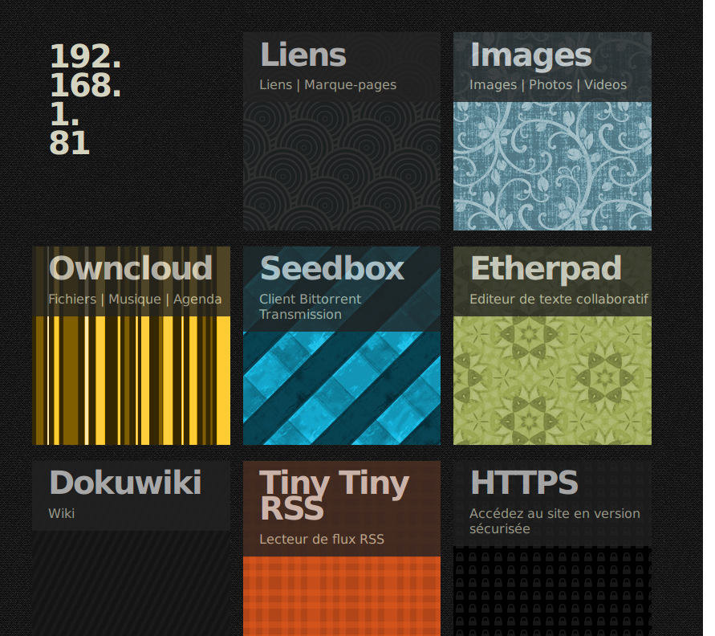

#NodeZero

A zero-configuration home server installation/maintenance solution.

This projects aims at
 * providing an easy and fast installation and maintenance solution for a personal home server.
 * providing free (as in speech) alternatives to commercial network services, such as file and media hosting and sharing, document editing, mail and news reading, communication services and more.
 * creating an accessible documentation about server operation and principles of Internet communication.
 * It should be able to run on low-end (recycled) machines.

 * [Documentation](doc/)
 * Bugs/feature requests
   * https://telecom.dmz.se/bugs/nodezero/issues
   * https://github.com/nodiscc/nodezero/issues

Status: Not ready.

