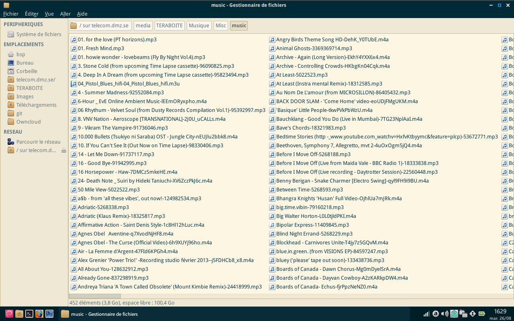

#NodeZero

Installation rapide et administration simplifiée de serveurs personnels (serveur auto-hébergé, _home server_), utilisant des alternatives [libres](https://fr.wikipedia.org/wiki/Logiciel_libre) aux services commerciaux/propriétaires sur Internet.

## Aide/Documentation
 * [A propos/pourquoi/qu'est ce que c'est?](doc/notes.md)
 * [Manuel d'utilisation](doc/README.md)
 * [Bugs/Questions](https://telecom.dmz.se/bugs/nodezero/issues)

## Fonctionnalités
### Serveur Web
Le logiciel libre Apache est le [serveur HTTP](https://fr.wikipedia.org/wiki/Serveur_HTTP) (serveur Web) le plus populaire du World Wide Web. [En savoir plus...](doc/apache.md)

#### Applications web
 * **Owncloud**: hébergement/partage/synchronisation de fichiers, calendriers,carnets d'adresses, édition de documents et plus [En savoir plus....](doc/applications/owncloud.md)
 * **Shaarli**: partage/sauvegarde de liens et de marque pages. [En savoir plus...](doc/shaarli.md)
 * **MinigalNano**: partage d'images, vidéos, fichiers multimédia. [En savoir plus...](doc/minigalnano.md)
 * **Tiny Tiny RSS**: receive news aund updates using RSS feeds, [read more](doc/tt-rss.md)
 * **Converse**: a web client for the XMPP (Jabber) instant messaging network, [read more](doc/applications/converse.md)
 * **Chyrp**: un moteur de blog léger et complet [En savoir plus...](doc/chyrp.md)
 * **MapBBCodeShare**: consultation de cartes géographiques, placement, sauvegarde et partage de repères, trajets et notes sur des cartes. [En savoir plus](doc/mapbbcodeshare.md) 
 * **Alltube**: service de téléchargement audio/vidéo depuis Youtube, Dailymotion, Soundcloud, Vimeo et plus de 100 autres sites. [En savoir plus](doc/alltube.md)
 * **Wallabag**: sauvegarde de pages web, liste de lecture, amélioration de la lisibilité et lecture hors ligne. [En savoir plus](doc/wallabag.md)
 * **Contact**: une page de contact simple et personnalisable. [En savoir plus...](doc/contact.md)
 * **YOURLS**: votre propre raccourcisseur d'URLs. [En savoir plus...](doc/yourls.md)
 * **Outils pour développeurs**
   * **Gitlist**: a modern git repository viewer. [Learn more...](doc/gitlist.md)
   * **Bumpy-Booby**: a modern task/bug tracking system. [Learn more...](doc/bumpy-booby.md)
   * **Markdown Edit**: un éditeur de documents en ligne utilisant le format Markdown. [En savoir plus...](doc/markdown-edit.md)

 

### Serveur de messagerie instantanée
Prosody IM est un serveur XMPP (serveur de messagerie instantanée) simple à utiliser. Il est conçu pour être facilement extensible à l'aide de greffons, et nécessite peu de ressources. [En savoir plus...](doc/prosody.md)


### Serveur SSH/partage de fichiers SFTP
SSH (_Secure Shell_) est un programme qui permet de se connecter à une machine distante et d'y exécuter des commandes (**contôle à distance**). Il fournit des  communications sécurisées et chiffrées. Il permet également de **partager des fichiers** (protocole _SFTP_) entre ordinateurs, d'utiliser les programmes du serveur sur votre écran local (_X forwarding_), et d'établir des **tunnels sécurisés** (par exemple pour utiliser le serveur distant comme _Proxy Web_). [En savoir plus...](doc/openssh.md)



### Console d'administration
La console d'administration est un système de menus facilitant les tâches courantes sur le serveur. [En savoir plus...](doc/nodezero-admin.md)
 
 * Surveillance de l'état du serveur: Usage disque, usage des ressources (RAM, CPU, réseau...), programmes en cours, tentatives de connection, informations de sécurité.
 * Sauvegardes: sauvegarde des données du serveur, des bases de données, des fichiers des utilisateurs
 * Installation, mise à jour et suppression de logiciels, activation/désactivation et configuration des services
 * Gestion des comptes utilisateur, permissions d'accès, mots de passe, dépannage.
 * Nettoyage de fichiers temporaires, tâches d'entretien/maintenance, redémarrage/extinction...

### Client Bittorrent / Seedbox
Transmission est un client pour le réseau [peer-to-peer](https://fr.wikipedia.org/wiki/Pair_%C3%A0_pair) [Bittorrent](https://fr.wikipedia.org/wiki/BitTorrent_%28protocole%29). [En savoir plus...](doc/transmission.md)


### Serveur multimedia uPnP
MiniDLNA est un serveur multimedia. Il sert des fichiers multimedia (musique, images et video) à des appareils connectés à votre réseau. Le client peut être un logiciel (xbmc, vlc, [autres clients](https://en.wikipedia.org/wiki/List_of_UPnP_AV_media_servers_and_clients#UPnP_AV_clients)) ou un appareil (lecteur multimedia portable smartphone, télévision, media center). [En savoir plus...](doc/minidlna.md)


### Partage de fichiers Windows Samba
| 📖 |    DEVELOPMENT       |
|---------|---------|

http://xmodulo.com/2014/08/samba-file-server-windows-clients.html
@todo add a menu entry to start/stop samba server
@todo add a menu entry to add/delete samba users
@todo add a menu entry to config for each user

#### Menu

```
   [1] List samba users
   [2] Add samba user
   [3] Delete samba user
   [4] Change password for a samba user
      [ ] Enter the name of the user you want to change the password for (prompt+check+smbpasswd)
   [5] Set file access permissions for a samba user
      [ ] Enter the name of the user (prompt+check)
        [ ] Directories with read-only access (edit /etc/nodezero/samba/username-ro.conf)
        [ ] Directories with read+write access (edit /etc/nodezero/samba/username-rw.conf)

```


```
#### /etc/nodezero/samba/username-ro.txt
## Enter a list of directories which $user will be able to read (only), including subdirectories
## One directory path on each line
/media/STORAGE/Programs
/media/STORAGE/Music
```

```
#### /etc/nodezero/samba/username-rw.txt
## Enter a list of directories which $user will be able to read and write to including subdirectories
## One directory path on each line
/media/STORAGE/Downloads
/media/STORAGE/Torrents
```
@todo ACLs: make sure the acl mount flag is enabled, when changing ro/rw directories list: make a copy of the original file, diff to the new, if it has changed remove ACLs for this user for all directories on old file, apply read only ACLs for dirs in ro.txt, rw ACLs for dirs in rw.txt


### Serveur OpenVPN
| 📖 |    Not yet implemented       |
|---------|---------|

 * Alternative: [tinc](http://tinc-vpn.org/)
  * [Setup Tinc](http://www.allsundry.com/2011/04/10/tinc-better-than-openvpn/)

### Service de transfert de fichiers
| 📖 |    Not yet implemented       |
|---------|---------|

### Serveur Mail
| 📖 |    Not yet implemented       |
|---------|---------|

 * [Newsletters spam test by mail-tester.com](http://www.mail-tester.com/)