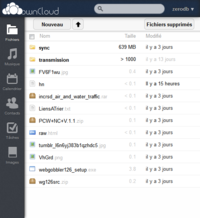

##Owncloud

Owncloud est un projet de gestion de vos données sur internet. Ses fonctionnalités comprennent:
  * **Accès web** - accedez à vos fichiers depuis n'importe où
  *  Support du **WebDAV**, permettant d'accéder à vos fichiers directement depuis un simple gestionnaire de fichiers.
  * **Partage** de fichiers en un clic - sélectionnez un fichier ou un dossier, et créez un lien permettant de le partager avec vos amis, collègues, le monde entier, etc...
  * Serveur de **calendriers** pouvant être utilisés depuis l'interface Web, ou un client tel que Thunderbird, Kontakt, iCalendar Evolution (CalDAV).
  * **Carnets d'adresses** utilisables dans l'interface web ou synchronisables via CardDAV.
  * **Streaming** de musique - parcourez votre collection de Musique depuis l'interface web, ou un logiciel client [ampache](https://en.wikipedia.org/wiki/Ampache#Extensions_.2F_APIs).
  * **Editeur** de texte/visionneuse PDF & ODT
  * Possibilité de lier des comptes Google Drive, Dropbox, Amazon S3, SMB, FTP, WebDAV, SFTP pour les utiliser comme répertoires dans l'interface d'Owncloud.

  * [Documentation Ubuntu-fr](http://doc.ubuntu-fr.org/owncloud)
  * [Features | ownCloud.org](http://owncloud.org/features/)

###Applications/modules
  * Storage charts - http://apps.owncloud.com/content/show.php?content=150004
  * Move files - http://apps.owncloud.com/content/show.php?content=150271
  * Quota bar - http://apps.owncloud.com/content/show.php?content=148938
  * Internal bookmarks - http://apps.owncloud.com/content/show.php?content=149975
  * SVG Editor - http://apps.owncloud.com/content/show.php?content=149713
  * Compress - http://apps.owncloud.com/content/show.php?content=150292

###Alternatives
####Synchronisation de fichiers
  * [Git Annex](http://git-annex.branchable.com/assistant/quickstart/) - Synchronisation de fichiers entre ordinateurs, disques externes, serveurs...
  * [Seafile](http://seafile.com/en/home/) - File Syncing and Collaboration for Teams

####Gestion de fichiers texte/documents
  * [Jotter](https://github.com/yosko/jotter) - Jotter is a lightweight, no database, powerful web notebook that lets you create and manage notes online safely, quickly & easily. ([Demo](http://tools.yosko.net/demos/jotter/) - login/pass: demo/demo)
  * [Laverna](https://laverna.cc/) - Laverna is a JavaScript note taking application with Markdown editor and encryption support. Consider it like open source alternative to Evernote ([SOurce on Github](https://github.com/Laverna/laverna), [Demo](https://laverna.cc/index.html#notes))

####Gestion de calendriers/carnets d'adresses/listes de tâches
  * [Radicale](http://radicale.org/) - A Simple Calendar and Contact Server
    * [Radicale Howto](http://www.techrepublic.com/blog/opensource/create-an-easy-to-use-linux-calendar-sharing-server/2042)
  * [calypso](http://keithp.com/calypso/) - a python-based CalDAV/CardDAV server
  * [AgenDAV](http://agendav.org/) - Multilanguage CalDAV web client with a rich AJAX interface and shared calendars support (FIXME à tester)
  * [Baïkal](http://baikal.codr.fr/) - Lightweight CalDAV+CardDAV server
    * [Installez votre synchronisateurs de contacts chez vous avec Baikal | IdleBlog](http://blog.idleman.fr/?p=2337)
  * [tasks.php](https://github.com/RaymiiOrg/tasks.php) - A simple task/todo list manager
  * [egroupware](http://www.egroupware.org/) - calendrier, répertoire, bloc notes,  planning, outils de gestion de projets, solution de gestion de la relation client, outil de gestion des connaissances, Wiki, CMS.

####Stockage de fichiers
  * [Dropcenter](http://projet.idleman.fr/dropcenter/) - Uploadez des fichiers par simple glisser-déposer.
  * [AjaXplorer](http://ajaxplorer.info/) - AjaXplorer is a software that can turn any web server into a powerfull file management system and an alternative to mainstream cloud storage providers.
  * [eXtplorer](http://extplorer.sourceforge.net/) - A PHP- and JavaScript- based File Manager
  * [Jyraphe](http://home.gna.org/jyraphe/) - Jyraphe is a web application of file repository, easy to install and easy to use.

  
###Liens Externes
 * https://www.microsoft.com/fr-fr/download/details.aspx?id=15123 - Mise à jour Windows nécessaire pour se connecter à un partage WebDAV
