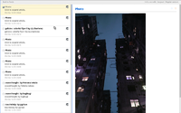
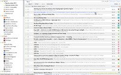
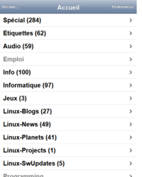

##Tiny Tiny RSS
Tiny Tiny RSS est un [Agrégateur](https://fr.wikipedia.org/wiki/Agr%C3%A9gateur) et lecteur et de flux [RSS](https://fr.wikipedia.org/wiki/RSS)/[Atom](https://fr.wikipedia.org/wiki/Atom) libre, vous permettant de lire des actualités et mises à jour de sites depuis n'importe quel endroit, avec une expérience proche des lecteurs de flux de bureau (comme [Liferea](?id=rxtx:internet#liferea). Ses fonctionnalités incluent:

  * Application sur le serveur, nécessitant juste un navigateur web
  * Prise encharge des flux RSS, RDF, et Atom
  * Lecture de flux protégés par mot de passe
  * Import/export [OPML](https://fr.wikipedia.org/wiki/OPML)
  * [Agrégation](https://fr.wikipedia.org/wiki/Agr%C3%A9gation_web) de flux
  * Partage direct d'articles (création d'un flux Rss personnalisé)
  * Filtrage
  * Raccourcis clavier

**Le standard RSS** représente un moyen simple d'être tenu informé des nouveaux contenus d'un site web, sans avoir à le consulter.

Le RSS permet aux internautes d’un site de s’abonner facilement aux dernières nouveautés du site. On utilise pour cela un agrégateur RSS : un logiciel à qui on donne la liste des sites dont on veut les news et il va aller les chercher sur tous les sites, en un seul clic. Un agrégateur RSS réduit donc le nombre de sites sur lesquels se rendre pour obtenir les dernières nouvelles à un seul: votre agrégateur RSS. Cela représente un gain de temps considérable et empĉhe les oublis. Avec RSS vous avez moins de chances de rater une info importante.

De plus, le RSS est simple à utiliser grâce à son format et ses spécifications ouvertes : on peut les combiner, les partager, les dupliquer, les trier… On peut créer nos propres outils utilisant RSS. RSS c’est ce qui permet de lier tous les sites entre-eux, facilement et simplement.

 

  * [Site Officiel](http://tt-rss.org/)
   * [Demo](http://tt-rss.org/demo/)
   * [Framanews](http://framanews.org/) - Instance publique gratuite de Tiny Tiny RSS
  * [RSS - Comment ça marche](http://www.commentcamarche.net/contents/www/rss.php3)
  * [Comment S'abonner au Flux RSS D'une Page Facebook ? [Tutoriel] | Emarketinglicious](http://www.emarketinglicious.fr/social-media/comment-abonner-au-flux-rss-page-facebook-tutoriel)
  * [Aggrégateurs (lecteurs de fils) RSS - Comment ça marche](http://www.commentcamarche.net/faq/3339-agregateurs-rss-lecteurs-de-fils-rss)
  * [The real reason Google wants to kill RSS - Boing Boing](http://boingboing.net/2013/07/03/the-real-reason-google-wants-t.html)

###Alternatives

  * [Leed](http://projet.idleman.fr/leed/) - Leed (contraction de Light Feed) est un agrégatteur RSS libre et minimaliste qui permet la consultation de flux RSS de manière rapide et non intrusive ([Dépôt Github](https://github.com/ldleman/Leed))
    * - Nécessite MySQL
  * [FreshRSS](http://freshrss.org/) - Un agrégateur de flux RSS à auto-héberger ([Demo](http://demo.freshrss.org/i/), [Dépôt Github](https://github.com/marienfressinaud/FreshRSS)]
  * [Selfoss](http://selfoss.aditu.de/) - The new multipurpose rss reader, live stream, mashup, aggregation web application ([Github project](https://github.com/SSilence/selfoss))
    * + Léger
    * + Interface agréable
    * - Pas de protection par mot de passe
  * [Creaky Coot](https://github.com/piero-la-lune/Creaky-Coot) - Minimalist and responsive RSS reader and links saver
    * + Léger
    * - Pas de classement par catégories/tags
  * [Miniflux](http://miniflux.net/) - Miniflux is a minimalist and open source news reader. ([Github repository](https://github.com/fguillot/miniflux)
    * + Léger
    * + Interface lisible
    * - Pas de classement par catégories/tags/flux
  * [Kriss Feed](http://tontof.net/kriss/feed/) - A simple and smart (or stupid) feed reader
([Demo](http://tontof.net/feed/), [Github repository](https://github.com/tontof/kriss_feed/))
    * - Interface difficile
  * [Liled](https://github.com/ypo/liled) - Liled is an aggregator, capable of reading Atom and RSS feeds ([Demo](http://liled.alwaysdata.net/app/index.php) - username/password: guest/guest)
  * [Stringer](https://github.com/swanson/stringer) - A [work-in-progress] self-hosted, anti-social RSS reader.
    * - Install difficile
  * [Feedbin](https://github.com/feedbin/feedbin) - a simple, fast and nice looking RSS reader. ([Site officiel](https://feedbin.me))
    * - Install difficile
  * [NewsBlur](https://github.com/samuelclay/NewsBlur) - NewsBlur is a personal news reader that brings people together to talk about the world. A new sound of an old instrument
    * - Install difficile
  * [FeedHQ](https://feedhq.org/) - FeedHQ is a web-based feed reader ([Github repository](https://github.com/feedhq/feedhq))
    * - Install difficile
  * [CommaFeed](https://github.com/Athou/commafeed) - Google Reader inspired self-hosted RSS reader ([Site officiel](https://www.commafeed.com/))
    * - Install difficile
  * [RSSminer](http://rssminer.net/) -An online rss reader written in clojure & javascript & java ([Github repository](https://github.com/shenfeng/rssminer))
    * - Install difficile
  * [Leselys](https://github.com/socketubs/leselys) - your very elegant RSS reader
    * - Install difficile

###Trucs & Astuces
####Logiciels supplémentaires
 * [RelatedSoftware - Tiny Tiny RSS](http://tt-rss.org/redmine/projects/tt-rss/wiki/RelatedSoftware)
 * [gritttt-rss](https://github.com/nhoening/gritttt-rss) - More features for TT-RSS ([Official site](http://gritttt-rss.nicolashoening.de/))

####Partager des liens
Il est possible de partager des liens sur différents réseaux (facebook, twitter, google+, et bien d'autres) depuis tt-rss.
 * Quelques plugins permettant de partager des articles sont disponibles dans la page `Préférences` de tt-rss, sous le menu `Plugins`.
Par exemple, si vous activez le plugin `twitter`, il sera possible de cliquer sur le bouton twitter dans chaque article pour le partager sur Twitter.
 * D'autres plugins intéressants sont disponibles sur http://tt-rss.org/redmine/projects/tt-rss/wiki/Plugins
 * Vous pouvez aussi vous rendre dans le flux spécial `Articles publiés` de votre installation Tiny Tiny RSS (qui regroupe tous les articles pour lesquels vous avez cliqué sur l'icône `Publier` puis sur l'icône  en haut à droite (sous le menu `Actions...`), puis effectuer une action à parit de ce flux avec le service [IFTTT](https://ifttt.com). Voir [IFTTT : automatiser des tâches courantes sur le web](http://www.commentcamarche.net/faq/34648-ifttt-automatiser-des-taches-courantes-sur-le-web)