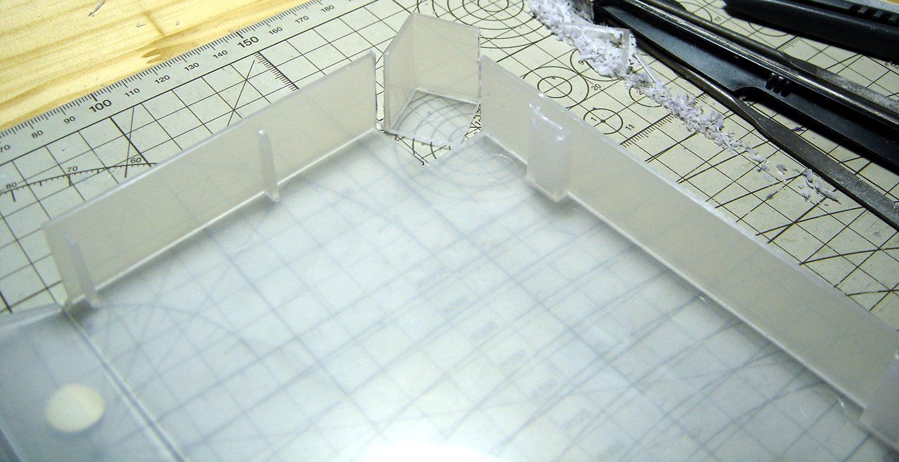
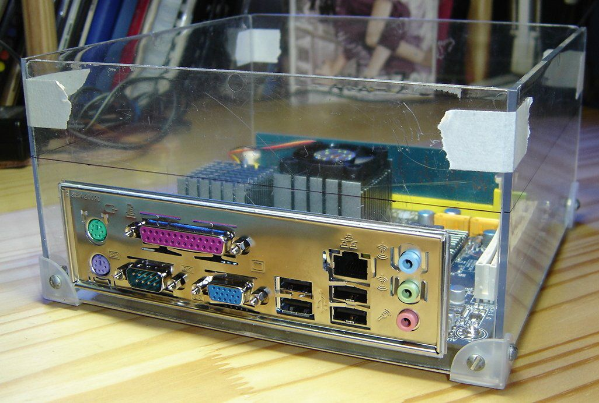
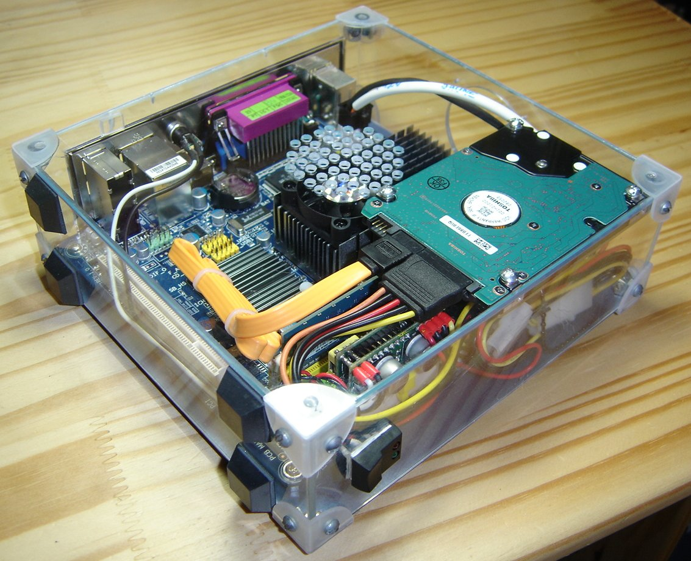
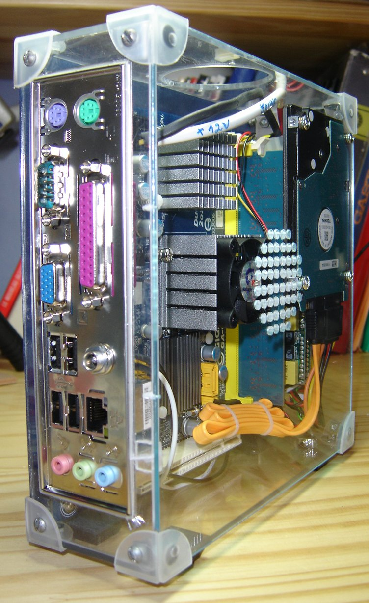
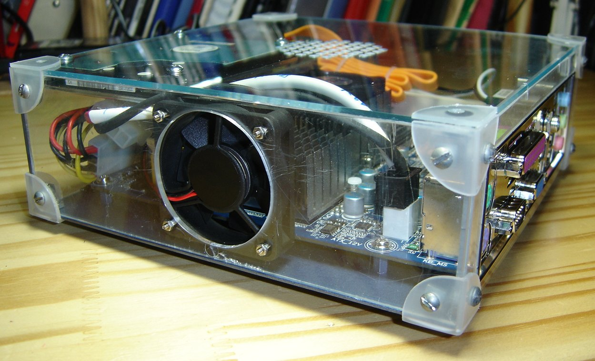

#Notes
##Coupures de courant
Si votre installation subit une coupure de courant, votre serveur s'éteint. Il sera donc indisponible pendant la coupure.

 * Si votre BIOS le supporte, activez l'option "Rallumer après une ocupure de courant" dans le menu du BIOS.
  * FIXME faire une capture d'écran du BIOS
 * Procurez vous un onduleur (UPS) qui alimentera le serveur pendant une coupure.
 * Gardez une copie des données du serveur sur vous si vous avez besoin d'y accéder en toutes circonstances
  * FIXME Faire quelques scripts d'export de données.

##Consommation électrique
 * Utiliser du matériel de recyclage peut coûter moins cher à l'acquisition, mais le vieux matériel a tendance à consommer plus de courant, et donc à faire monter la facture d'électricité. (`FIXME de quel ordre?`) Utilisez si possible du matériel récent à l'assemblage de votre serveur.
 * Les alimentations de type [PicoPSU](http://www.silentpcreview.com/article601-page1.html) peuvent aider à réduire la consommation et le bruit du serveur.
 * Si vous disposez déjà d'un ordinateur, vous pouvez l'utiliser comme serveur (pas d'augmenantion de votre facture d'électricité). Si votre ordinateur ne fonctionne pas déjà sous [Debian GNU/Linux](https://www.debian.org/), il est possible de faire fonctionner le serveur dans une [machine virtuelle](https://fr.wikipedia.org/wiki/Machine_virtuelle) (voir [le foncitonnement de base de Virtualbox](http://www.commentcamarche.net/faq/9376-virtualbox-tester-des-os-comme-des-logiciels-tutoriel-kubunt))
 * Un [Raspberry Pi](https://fr.wikipedia.org/wiki/Raspberry_Pi) ne consomme en moyenne qu'1 à 2 watts et peut remplacer un serveur basé sur un PC.

##Stabilité de la connection
Préférez une connection filaire (câble Ethernet) si possible. Une connection Wifi est acceptable, mais veillez à la qualité de la réception.

##Boîtier
Si vous n'avez pas de boîtier, vous pouvez toujours vous en fabriquer un!

_Source: http://burogu.makotoworkshop.org/index.php?post/2009/09/17/auto-heberger-4_

###Bannissement d'adresses IP
Il est inutile de bannir des adresses IP à la sources d'attaque sur votre serveur, si celui ci est à jour et correctement configuré. Oubliez donc fail2ban et les outils de bannissement automatique. Voir https://quack1.me/ban_ip_filtrage.html 