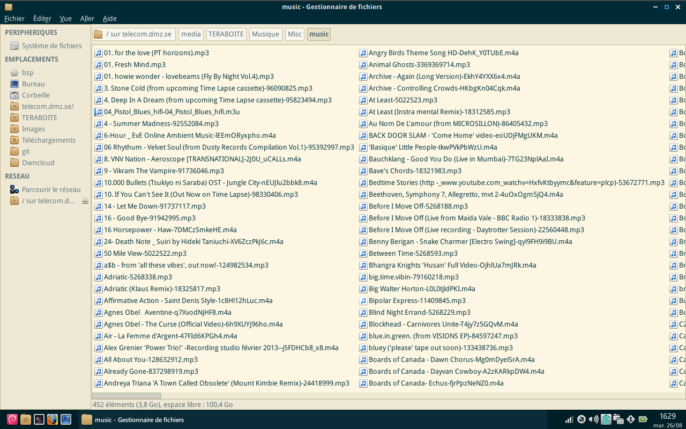

### Serveur SSH/partage de fichiers SFTP OpenSSH

SSH (_Secure Shell_) est un programme qui permet de se connecter à une machine distante et d'y exécuter des commandes (**contrôle à distance**). Il fournit des  communications sécurisées et chiffrées. Il permet également de **partager des fichiers** (protocole _SFTP_) entre ordinateurs, d'utiliser les programmes du serveur sur votre écran local (_X forwarding_), et d'établir des **tunnels sécurisés** (par exemple pour utiliser le serveur distant comme _Proxy Web_).

#### Accès aux fichiers par SFTP

_Note: Unlike FTP, SFTP is a **secure** file transfer protocol. Transfers and authentication are encrypted over the network, menaning an attacker can not sniff your password or transferred data over the network. Secure mechanisms for FTP transfers also exist, but SFTP is remarkably easier to configure. See http://mywiki.wooledge.org/FtpMustDie_

 * [Explication détaillée de l'authentification par clé SSH (en)](https://we.riseup.net/debian/ssh-key-authentication)

